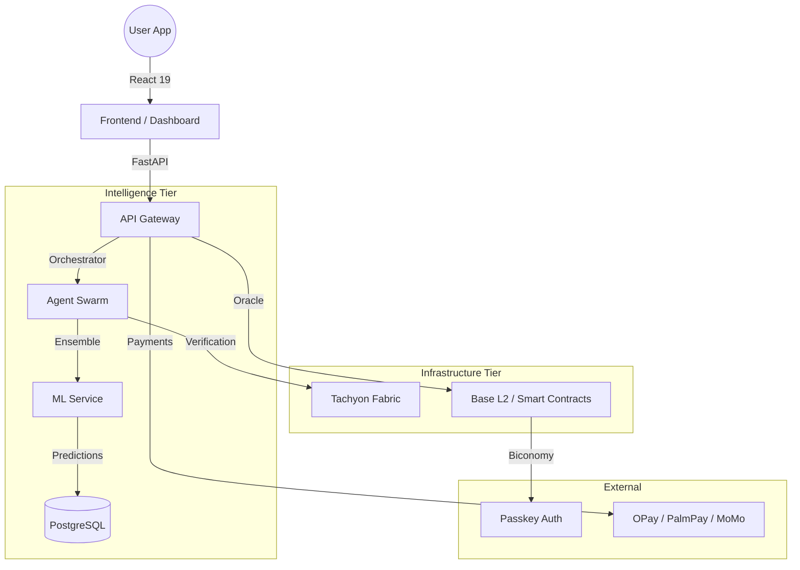

# VIT Network: Africa's AI Intelligence Oracle & Blockchain Super App

[](https://github.com/vit-network/vit-blockchain)
[](https://base.org)
[](app/ai)

VIT is the premier intelligence layer for the African digital economy. By combining a multi-model AI ensemble with a decentralized agent swarm and Base L2 settlement, VIT provides verifiable, high-confidence insights for sports, elections, policy, and marketplace intelligence.

---

## 🌟 Vision
To build Africa's largest digital super network, empowering 100 million users with verifiable intelligence, seamless financial inclusion, and a decentralized marketplace for the next generation of the African economy.

## 🚀 The Real System (Audit Summary)
Unlike traditional platforms, VIT is a living ecosystem built on three core layers:
1.  **Intelligence Tier**: 13+ ML models (LSTM, XGBoost, Transformer) orchestrated by an autonomous agent swarm.
2.  **Infrastructure Tier**: High-speed decentralized storage (Tachyon Fabric) and persistent PostgreSQL state.
3.  **Settlement Tier**: Gasless transactions via Biconomy and smart contract oracles on Base L2.

---

## 📦 Core Products

### 🏆 Sports Intelligence (Production Ready)
- **AI Ensemble**: Real-time predictions across major football leagues with 60/40 weight distribution between Scikit-learn and PyTorch LSTM models.
- **VIT Score**: A proprietary high-confidence metric for signal reliability.
- **Smart Settlements**: Automated on-chain result verification via `UniversalOracle.sol`.

### 🤖 Autonomous Agent Swarm (Production Ready)
- **22+ Specialized Agents**: Including Audit Sentinels, Fraud Reviewers, and Market Scouts.
- **Lazy-Loading Architecture**: Optimized for memory-constrained environments (512MB RAM).

### 💳 Wallet & Financial Services (Production Ready)
- **Regional Payments**: Support for OPay, PalmPay, and MTN MoMo.
- **Gasless UX**: Biconomy account abstraction for seamless user onboarding.
- **Loyalty Vault**: Automated yield and rewards for ecosystem participants.

### 🏪 Signal Marketplace (Beta)
- **Peer-to-Peer Intelligence**: Users can list and subscribe to custom AI models.
- **Staking & Slashing**: Protocol-level incentives for signal accuracy.

### 🌌 Tachyon Fabric (Beta)
- **Swarm Storage**: Parallel burst transfers across aggregated cloud providers (Gdrive, etc.).
- **Quantum-Safe**: EEC-based erasure coding for high-speed fragmentation.

### 🏛️ Elections & Policy (In Development)
- **Sentiment Engine**: Real-time analysis of citizen sentiment and electoral polling.
- **Policy Simulator**: Verifiable forecasts for regional economic and political shifts.

---

## 🏗️ Architecture



---

## 🛠️ Technology Stack
- **Backend**: FastAPI (Python 3.11+), SQLAlchemy, Uvicorn.
- **Frontend**: React 19, Vite, Tailwind CSS, Lucide React.
- **AI/ML**: Scikit-learn, XGBoost, PyTorch, Ollama (Internal VIT Brain).
- **Blockchain**: Solidity 0.8.28, Foundry, Viem, Biconomy SDK.
- **Database**: PostgreSQL (Production), Redis (Caching), ChromaDB (RAG).
- **Storage**: Tachyon Fabric (Fragmentation + EEC).

---

## 📂 Repository Structure
- `app/`: Core FastAPI application and agent logic.
- `frontend/`: React 19 single-page application.
- `packages/contracts/`: Smart contracts (Foundry).
- `packages/sdk/`: TypeScript SDK for ecosystem integrations.
- `services/ml_service/`: Decentralized ML orchestrator.
- `tachyon/`: Parallel swarm storage coordination service.
- `scripts/`: Deployment, training, and maintenance utilities.

---

## 🏁 Getting Started

### Quick Start
```bash
# Install dependencies
npm install && pnpm install --filter "./frontend"

# Start the full stack (Development)
./scripts/start_fullstack.sh
```

### Backend Setup
```bash
# Configure environment
cp .env.example .env

# Run backend
./scripts/start_backend.sh
```

### Frontend Setup
```bash
cd frontend
pnpm install
pnpm dev
```

---

## 🗺️ Roadmap
- **Q4 2024**: Full migration to Base L2 and Tachyon Beta launch. (Completed)
- **Q1 2025**: Electoral Oracle integration and Agent Recruitment Portal.
- **Q2 2025**: Cross-border remittance rails via .
- **Q3 2025**: Expansion to Kenya and Ghana ecosystems.

See [ROADMAP.md](ROADMAP.md) for the detailed strategic plan.

---

## 🤝 Contributing
We welcome contributors from all backgrounds. Please see our [Integration Guide](INTEGRATION_GUIDE.md) for technical standards.

## 🛡️ Security
For security disclosures, please refer to our internal security team via the [Security Dashboard](frontend/src/pages/security.tsx).

## 📄 License
Check individual modules for licensing. A root LICENSE file is pending (See Gap Analysis).

---

Built with ⚡ by the VIT Network Foundation.
