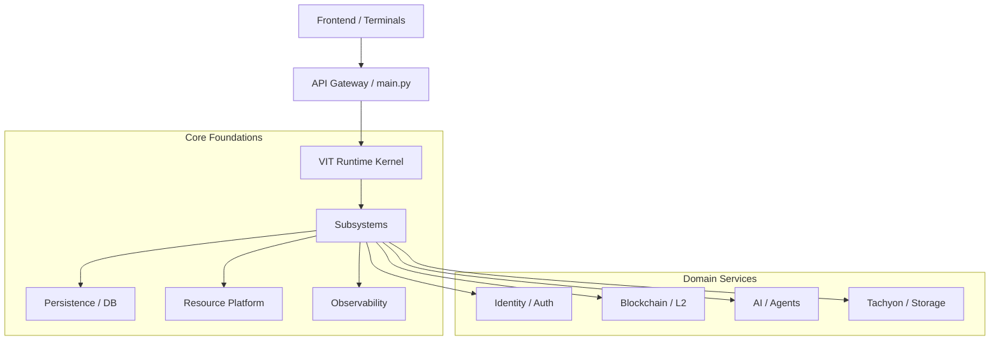

# Repository Dependency Map

## 1. Visual Topology (Monorepo)
The ecosystem follows a hierarchical "Onion" architecture with the VIT Kernel at the center.

## 2. Inter-Component Connectivity
- **Shared SDK**: `sdk/python` provides a unified interface for external tools.
- **Module Contracts**: Defined in `.engineering/state/contracts.json`, ensuring stable interfaces for AI and DB.
- **Subsystem Registration**: `app/core/subsystems.py` orchestrates the boot order.

## 3. Dependency Rules
1. **Unidirectional**: Domain services depend on Core Foundations. Core Foundations MUST NOT depend on Domain Services.
2. **Contractual**: All cross-domain calls must go through the Registry or defined SDK interfaces.

**Confidence Level: High** (Verified at 925ca8c).
