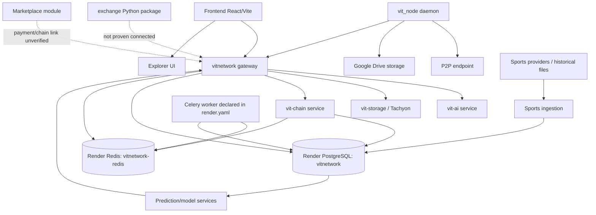

# VIT Ecosystem Architecture Map

## Actual discovered topology

## Service inventory

| Component | Source | Deployment evidence | Dependencies | Reality |
|---|---|---|---|---|
| Gateway/API | `app/`, `main.py`, Render `vitnetwork` | Render web service, health path declared | PostgreSQL, Redis, AI, storage, chain | PARTIALLY_IMPLEMENTED |
| AI | `app/modules/ai`, `app/services/vit_ai_client.py` | Render `vit-ai` active | provider credentials, gateway callers | BLOCKED/PARTIAL |
| Storage/Tachyon | `tachyon/`, storage modules | Render `vit-storage` active | Redis, external storage providers | PARTIAL |
| Chain | `vit_chain/` | Render `vit-chain` active | persistence, P2P, Redis | PARTIAL; consensus unproven |
| Explorer | `explorer/` | Render `vit-explorer` active | explorer API/chain | PARTIAL |
| Node | `vit_node/` | CLI/daemon source; no Render node service | P2P, Drive, gateway | PARTIAL; dummy key |
| Worker | `app/worker/`, `scripts/start_worker.sh` | declared in blueprint; not in returned Render services | Redis, PostgreSQL | DOCUMENTED_ONLY in deployed inventory |
| PostgreSQL | Alembic/models; Render resource | `vitnetwork`, available | gateway/worker/chain | PARTIAL; naming drift |
| Redis | Celery/cache/config; Render resource | `vitnetwork-redis`, available | gateway/worker/chain | PARTIAL |
| Exchange | `exchange/` | no service deployment identified | wallet/API/persistence | ORPHANED/PARTIAL |
| Commerce | marketplace module/frontend | no Piluno service identified | payments, users, inventory | DOCUMENTED_ONLY/PARTIAL |

## Control-flow boundaries

1. Browser routes are declared in `frontend/src/App.tsx`; protected routes use `RequireAuth` and lazy page imports.
2. `frontend/src/lib/api.ts` obtains gateway/AI/storage/chain URLs from Vite env and registry bootstrap.
3. Gateway AI requests enter `AIGateway.route_chat`, call `vit_ai_client`, then local orchestrator fallback, then a fixed offline message.
4. Node startup enters `VITNodeDaemon.run`, loads JSON config/keystore, derives a public key, connects to P2P, and starts monitor/earnings/receive loops.
5. Chain source contains core, crypto, consensus, P2P, RPC and storage packages, but no verified deployed multi-node execution path was established.
6. Worker tasks are declared under `app/tasks` and `app/worker/tasks`; Render declares a worker but the live service inventory returned only web services.

## Broken links and drift

- Render and dependency configuration now reference the live database resource `vitnetwork`; production migration state remains unverified.
- The node client now sends a protocol-compliant public-key handshake; server-side signature verification is still absent.
- Explorer client assumes `/api/explorer/*`; live backend contract was not verified.
- Exchange package has no demonstrated connection to the active API/database/wallet transaction path.
- Marketplace/Piluno claims have no verified external commerce execution path.
- Test execution is blocked before collection by missing SQLAlchemy.
