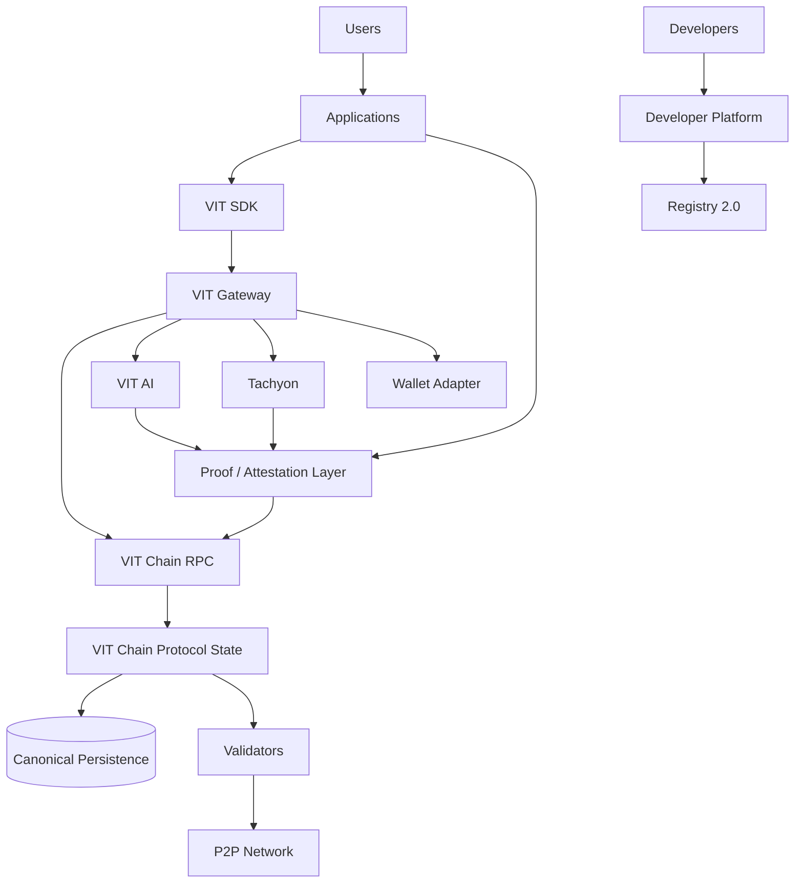

# VIT Network Protocol Architecture Specification

_Status: design proposal only; no implementation performed._
_Date: 2026-09-22_

## Design Status Vocabulary

- **EXISTING**: present in executable source and observable behavior.
- **PROPOSED**: target design, not implemented.
- **REQUIRES PROTOCOL CHANGE**: changes canonical chain state or validation.
- **REQUIRES GOVERNANCE**: requires policy approval before implementation.
- **REQUIRES NEW SERVICE**: needs a new durable service or authority.
- **REQUIRES SDK CHANGE**: changes public client contracts.

## 1. Executive Decision

VIT Chain is the authoritative state layer for protocol facts. VIT Network is the gateway and coordination layer. VIT AI and Tachyon produce signed, hash-addressed outputs above the protocol. Applications consume standardized SDK primitives and do not create competing monetary ledgers.

The chain stores compact state transitions, object references, hashes, attestations, payments, and protocol events. Large data, AI payloads, model artifacts, and application content remain off-chain.

The maximum VIT supply is intentionally unresolved. Monetary enforcement is therefore outside this design's implementation scope and remains **REQUIRES GOVERNANCE**.

## 2. Four Protocol Layers

| Layer | Responsibilities | Authoritative state | APIs | Security boundary | Economic interaction |
|---|---|---|---|---|---|
| L1: VIT Chain | Blocks, transactions, accounts, balances, fees, staking, validators, protocol supply, proofs and finality | Canonical replicated chain state | Native JSON-RPC, protocol REST, event stream | Consensus, signatures, replay protection, deterministic state transition | Native VIT settlement and protocol fees |
| L2: VIT Network infrastructure | Gateway, service registry, identity adapter, wallet adapter, AI/Tachyon orchestration, indexing, notifications | Service state and indexed caches; never protocol facts | Gateway REST/WebSocket, service APIs, adapters | Service authentication, tenant isolation, rate limits | Billing and payment orchestration settled through L1 |
| L3: Developer Platform | App/developer registration, credentials, scopes, SDKs, CLI, webhooks, sandboxes | Developer/app metadata and delegated permissions | Developer API, SDK, CLI, webhook API | Least privilege, app isolation, key rotation, quotas | Developer fees and app payments use L1 references |
| L4: Applications | M24, sports intelligence, marketplaces, games, third-party workflows | Application business state | App APIs and UI | Application authorization and domain rules | Application payments reference L1 payment IDs |

## 3. Current Versus Target Architecture



Current violations include gateway wallet balances, embedded chain state, `IoTEvent` chain state, standalone `ChainBlock` state, simulated supply metrics, and Base-oriented SDK/contracts. These must be treated as migration targets, not parallel authorities.

## 4. Protocol Primitives

| Primitive | On-chain minimum | Off-chain portion |
|---|---|---|
| Identity | Stable subject ID, key/controller reference, revocation pointer | KYC, profile, recovery metadata, documents |
| Account | Account ID, owner/controller, nonce, asset balances, locks | Labels, preferences, UI profile |
| Payment | Payment ID, payer, payee, asset, amount, fee, status, replay nonce | Invoice, cart, fulfillment, receipts |
| Staking | Bond ID, validator, owner, amount, lock/unlock state | Validator operations, hardware/storage metadata |
| Validator | Validator ID, signing key, status, stake reference, activation state | Endpoint, capacity, monitoring, location |
| Application | App ID, developer ID, version, status, capability hash | App metadata, binaries, UI, support |
| Developer | Developer ID, controller, status, registered app references | Organization profile, billing profile |
| Permissions | App/developer subject, scope hash, expiry/revocation | Consent UI, policy explanation |
| Events | Event ID, type, source, block reference, payload hash | Payload, subscribers, delivery state |
| Data proof | Object reference, content hash, signer, timestamp, proof type | Full object and evidence |
| AI attestation | Result hash, model ID/version, evidence reference, signer | Prompt/input/output, model artifacts |
| Storage reference | Object ID, manifest hash, provider-independent reference | Shards, metadata, retrieval protocol |
| Application object | Object ID, owner, type, version, data hash, status | Domain-specific payload |

## 5. Digital Object Model

Every VIT object should use a canonical envelope:

```json
{
  "object_id": "obj_...",
  "owner": "did:vit:...",
  "type": "AIResult",
  "version": "1.0",
  "created_at": "2026-09-22T00:00:00Z",
  "data_hash": "sha256:...",
  "storage_reference": "tachyon:...",
  "proof": "proof_...",
  "permissions": "perm_...",
  "status": "active"
}
```

On-chain: `object_id`, owner/controller, type/version, hashes, references, proof IDs, timestamps, status, and revocation state.

Off-chain: payloads, documents, model files, evidence bundles, access-control detail, UI metadata, and delivery state.

Object IDs must be globally unique, content hashes must use a versioned algorithm prefix, and canonical serialization must be specified before signing.

## 6. Proof Protocol

### Proof envelope

```json
{
  "proof_id": "proof_...",
  "proof_type": "data_integrity|storage|ai_attestation|event|prediction_provenance",
  "object_id": "obj_...",
  "object_version": "1.0",
  "data_hash": "sha256:...",
  "evidence_reference": "tachyon:manifest/...",
  "timestamp": "2026-09-22T00:00:00Z",
  "chain_id": 7764,
  "block_reference": {"height": 0, "tx_hash": "0x..."},
  "signer": "did:vit:...",
  "model_id": "model_...",
  "model_version": "...",
  "result_hash": "sha256:...",
  "signature": "ed25519:...",
  "status": "attested"
}
```

Verification:

1. Resolve the object and proof envelope.
2. Recompute canonical payload hash.
3. Resolve signer key and revocation state.
4. Verify signature and chain ID.
5. Verify referenced block/transaction finality.
6. Resolve Tachyon manifest where required.
7. Compare evidence/result hashes.
8. Return `verified`, `invalid`, `revoked`, or `unavailable`.

The protocol proves provenance, integrity, timestamp, signer and attestation. It does not prove that an AI output is correct.

## 7. AI Attestation

```text
input reference
  -> evidence manifest
  -> model ID and version
  -> inference request ID
  -> canonical result
  -> result hash
  -> model/service signature
  -> chain attestation transaction
```

Proposed `AIInferenceCompleted` payload:

```json
{
  "inference_id": "inf_...",
  "application_id": "app_...",
  "input_hash": "sha256:...",
  "evidence_reference": "tachyon:manifest/...",
  "model_id": "model_...",
  "model_version": "v2.1.0",
  "result_hash": "sha256:...",
  "attestation_signer": "did:vit:...",
  "created_at": "...",
  "chain_reference": "tx_..."
}
```

VIT AI owns inference execution and result payloads. The chain owns the attestation reference and finality. This is **PROPOSED**, **REQUIRES PROTOCOL CHANGE**, and **REQUIRES NEW SERVICE** for key/attestation management.

## 8. Tachyon Data Availability

```text
upload -> canonical hash -> erasure-coded manifest -> provider storage
       -> challenge/proof -> compact chain reference
```

Tachyon owns object bytes, shards, provider placement, manifests and challenge execution. VIT Chain stores the object/manifest hash, proof ID, signer, and finality reference.

Storage challenges should be verified by a storage service and represented as protocol attestations. Storage implementation details should not become consensus logic unless governance explicitly defines a block-validity rule.

## 9. Application Identity

```json
{
  "app_id": "app_...",
  "developer_id": "dev_...",
  "version": "1.0.0",
  "account_id": "acct_...",
  "credentials": ["cred_..."],
  "permissions": ["chain.read", "ai.infer"],
  "resource_limits": {"requests_per_minute": 120},
  "dependencies": {"ai": "^1", "storage": "^1", "chain": "7764"},
  "status": "active"
}
```

Users authorize an app by granting scoped, expiring consent. The gateway validates credentials and scopes; chain transactions still require account-level authorization and signatures.

## 10. Permission Model

Standard scopes:

```text
identity.read
identity.write
wallet.read
wallet.transfer
chain.read
chain.submit
storage.read
storage.write
ai.infer
events.subscribe
proof.create
proof.verify
registry.read
registry.write
```

- Users grant application scopes.
- Developers manage app metadata but cannot impersonate users.
- Applications receive delegated scopes only.
- Services use service identities and narrow service scopes.
- Validators receive protocol scopes distinct from application scopes.
- High-risk scopes require step-up authorization and explicit transaction signing.

Default: deny. Scope, audience, expiry, nonce, tenant, and revocation must be checked on every gateway request.

## 11. Wallet Model

A unified wallet model has one protocol account authority:

- User wallet: user-controlled account.
- Application wallet: app-controlled or policy-controlled account with spending limits.
- Module account: protocol/application escrow account.
- Validator account: validator signing account plus explicit stake bond.

The gateway may cache or index balances, but must label them as projections and reconcile against VIT Chain. It must not create native VIT balances independently.

Payment flow:

```text
app requests quote -> user approves -> wallet signs -> chain submits
-> chain finalizes -> gateway indexes -> app receives event
```

## 12. Event Protocol

```json
{
  "event_id": "evt_...",
  "event_type": "PaymentConfirmed",
  "source": "vit-chain|gateway|ai|tachyon|application",
  "timestamp": "...",
  "block_reference": {"height": 1, "tx_hash": "0x..."},
  "payload_hash": "sha256:...",
  "signature": "...",
  "payload_reference": "tachyon:...",
  "subscribers": "subscription_..."
}
```

Protocol events: block finality, payments, validator state, staking, proof anchoring. Service events: uploads, AI completion, webhook delivery. Application events: predictions, orders, domain actions.

Event delivery is at-least-once. Consumers require event IDs, replay protection, cursor/ack state, and signature verification.

## 13. Registry 2.0

The current registry is primarily health/service discovery: `backend/app/api/routes/registry.py`, `GET /api/registry`. Registry 2.0 should index:

- Developers and applications
- Modules, versions and capabilities
- API contracts and compatibility
- Permissions and resource limits
- AI/storage/chain dependencies
- Payment requirements
- Lifecycle: draft, active, suspended, retired
- Proof and deployment references

Proposed APIs:

```text
POST   /v2/developers
GET    /v2/developers/{id}
POST   /v2/apps
GET    /v2/apps/{id}
POST   /v2/apps/{id}/versions
POST   /v2/apps/{id}/credentials
POST   /v2/apps/{id}/permissions
POST   /v2/apps/{id}/suspend
GET    /v2/capabilities
GET    /v2/compatibility
GET    /v2/services/health
```

Registry metadata is platform state. App ownership, capability hashes and lifecycle attestations may be anchored on-chain; full metadata remains off-chain.

## 14. Unified SDK

```text
vit.identity
vit.wallet
vit.chain
vit.storage
vit.ai
vit.registry
vit.payments
vit.events
vit.proofs
```

Targets:

- TypeScript/web/backend
- Python/backend/agents
- Kotlin/Android
- Swift/iOS

The chain client must target native VIT Chain `7764` and its RPC. The current TypeScript SDK targets Base/Base Sepolia and therefore **REQUIRES SDK CHANGE**. SDK objects must expose explicit statuses: confirmed, pending, rejected, unavailable, and projection.

## 15. Developer CLI

Commands:

```text
vit create
vit dev
vit test
vit register
vit deploy
vit logs
vit events
vit wallet
vit chain
```

Project shape:

```text
vit-app/
  vit.yaml
  src/
  permissions/
  manifests/
  proofs/
  tests/
```

`vit.yaml` declares app ID, developer ID, chain ID, permissions, service dependencies, resource limits, and environments. CLI operations must never print secrets and must separate local, testnet, and production credentials.

## 16. M24 Reference Application

M24 should consume:

```text
M24 -> identity -> app authorization
M24 -> wallet -> signed VIT payments
M24 -> AI -> inference + attestation
M24 -> Tachyon -> documents/data + manifests
M24 -> Registry -> capabilities and versions
M24 -> Events -> subscriptions and notifications
M24 -> VIT Chain -> payments, objects, proofs, finality
```

M24 proves that a new application can use identity, payments, AI, storage and proof primitives without its own pseudo-ledger or custom chain adapter.

No canonical M24 implementation was found in the audit; this is **PROPOSED**.

## 17. Sports Intelligence Reference Module

```text
sports data
 -> match intelligence profile
 -> evidence manifest
 -> model ensemble
 -> prediction result
 -> AI attestation
 -> Tachyon evidence reference
 -> provenance proof
 -> VIT Chain anchor
```

The chain records evidence/result/model references and signatures. It does not assert prediction correctness. Settlement is a separate application/payment rule based on a later oracle/result event.

## 18. Economic Interaction Map

| Interaction | Payer | Receiver | Asset | Settlement | Proof/event |
|---|---|---|---|---|---|
| Transaction fee | Account | Protocol/fee sink | VIT | VIT Chain | PaymentConfirmed |
| Staking | Account | Bond/validator state | VIT lock | VIT Chain | StakeChanged |
| Validator reward | Protocol | Validator account | VIT | VIT Chain | RewardMinted |
| Storage | App/user | Tachyon provider/treasury | VIT | Chain payment + service record | StorageUploaded/PaymentConfirmed |
| AI inference | App/user | AI service/developer | VIT | Chain payment + gateway service | AIInferenceCompleted |
| Developer billing | App | Developer Platform | VIT | Chain payment reference | PaymentConfirmed |
| Marketplace | Buyer | Seller/escrow | VIT | Chain escrow/payment | OrderSettled |
| Burn | Protocol-defined payer | Irrecoverable sink | VIT | Chain state transition | BurnRecorded |
| Slashing | Validator bond | Protocol-defined destination/sink | VIT | Chain state transition | ValidatorSlashed |

Maximum supply, burn rules, reward policy, and fee destination remain **REQUIRES GOVERNANCE**.

## 19. Security Architecture

- Identity: DID/key controller model with revocation and recovery separation.
- Key management: hardware-backed validator keys; scoped app keys; rotation and expiry.
- Isolation: per-app credentials, tenants, accounts, storage namespaces and event subscriptions.
- Replay protection: chain nonce, domain-separated signatures, chain ID, expiry and event IDs.
- Proof verification: canonical serialization, hash algorithm prefix, signer key resolution, revocation check and finality check.
- API authentication: short-lived access tokens, service identity, mTLS or signed service requests for sensitive paths.
- Validator security: key isolation, anti-double-sign state, peer authentication, rate limits and persistent slashing evidence.
- Payment security: user confirmation, spend limits, idempotency keys and chain receipt verification.
- AI security: signed model identity, evidence binding, result hash, no claim of semantic correctness.
- Storage security: manifest integrity, provider isolation, proof freshness, challenge replay protection.

## 20. Source-of-Truth Rule

1. Protocol fact: VIT Chain is authoritative.
2. Service fact: the responsible service is authoritative.
3. Application fact: the application is authoritative.
4. Gateway values are projections unless they are explicitly gateway-owned service state.
5. A gateway projection must include source, block/transaction reference, timestamp, and freshness/status.
6. No fallback numeric value may masquerade as protocol state.

## 21. Five-Phase Roadmap

### Phase 1: Protocol Truth

Dependencies: governance decisions on supply, fees, staking and canonical persistence.

Components: canonical chain state, account/balance model, supply transition model, validator/stake model, proof references.

APIs: versioned RPC/REST for blocks, accounts, payments, supply, validators and proofs.

Security: deterministic transitions, integer base units, signatures, nonce/replay protection, finality.

Validation: state-transition vectors, genesis/reward/fee/burn tests, persistence recovery, invariant checks.

Exit: one authoritative chain state and no gateway pseudo-ledger for native VIT.

### Phase 2: Network Truth

Dependencies: Phase 1 state transitions.

Components: peer identity, discovery, sync, fork choice, checkpoints, validator activation, recovery.

APIs: peer protocol, sync endpoints, finality and checkpoint queries.

Security: authenticated peers, anti-equivocation, rate limiting, snapshot verification.

Exit: multiple nodes converge on the same finalized state and recover from restart/network partitions.

### Phase 3: Proof, Data and AI Infrastructure

Dependencies: object/proof envelopes and canonical chain references.

Components: Tachyon manifests, proof service, AI attestation service, evidence indexer.

APIs: proof create/verify, object reference, AI attestation, storage challenge status.

Security: signer registry, key rotation, hash binding, evidence access control.

Exit: an AI result and stored dataset can be independently verified without storing payloads on-chain.

### Phase 4: Developer Platform

Dependencies: stable protocol APIs and proof/event contracts.

Components: Registry 2.0, app/developer identity, scopes, SDKs, CLI, billing, webhooks, sandbox.

APIs: app registration, credentials, permissions, events, payments and compatibility.

Security: least privilege, app isolation, quota enforcement, secret rotation.

Exit: a third-party app can register, request permissions, sign a payment, use AI/storage, and verify proofs using SDK/CLI primitives.

### Phase 5: Application Ecosystem

Dependencies: all prior phases.

Components: M24, sports intelligence, marketplace and third-party app templates.

Validation: conformance suites, economic settlement tests, proof verification, upgrade compatibility.

Exit: applications share infrastructure without independent ledgers, conflicting identity, or bespoke chain integrations.

## 22. Classification Summary

| Item | Status |
|---|---|
| Native VIT Chain | EXISTING, operational but single-node-like |
| Gateway | EXISTING, degraded integration |
| Registry | EXISTING service registry; PROPOSED ecosystem registry |
| VIT AI | EXISTING/partial |
| Tachyon | EXISTING/partial |
| Wallet | EXISTING application ledger; PROTOCOL migration required |
| Developer API keys/plans | EXISTING/partial |
| Native VIT SDK | PROPOSED; current TypeScript SDK requires change |
| M24 | PROPOSED, no canonical implementation found |
| Proof protocol | PROPOSED, requires protocol/service changes |
| Application identity | PROPOSED, requires new platform state |
| Maximum supply policy | REQUIRES GOVERNANCE |
| Consensus replacement | OUT OF SCOPE |

## 23. Exact First Implementation Task

Before implementing features, produce and approve a **Protocol State Contract v1** containing:

1. Canonical state entities and ownership.
2. Canonical persistence model.
3. Account/balance/stake relationship.
4. Payment and fee transition schema.
5. Proof envelope and canonical serialization.
6. Event envelope and finality semantics.
7. Gateway projection contract.
8. Governance decisions required for monetary policy.

Only after this contract is approved should implementation begin. The first code slice should be a conformance/read-model adapter that makes the gateway consume standalone VIT Chain state without creating a second native-VIT ledger.
