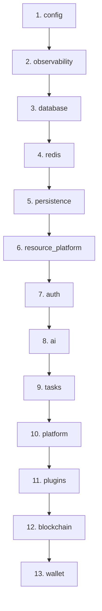

# VIT Network — Subsystem Boundaries & Domain Architecture

**Version:** 6.0.0
**Domain:** /docs/backend-boundaries/
**Status:** Architecture Approved

---

## 1. Overview & Monolith Modularity

The VIT Network backend is designed as a **modular monolith** written in Python (FastAPI). To prevent spaghetti code and tight coupling, strict domain boundaries are maintained. Each of the 13 core subsystems runs as an isolated logical unit loaded dynamically by the central runtime kernel.

---

## 2. Core Kernel Subsystems (The 13 Subsystems)

Below is the definitive subsystem registry, matching the live bootstrap sequence of the runtime:

```
                  ┌─────────────────────────────────┐
                  │          RUNTIME KERNEL         │
                  └────────────────┬────────────────┘
                                   │
         ┌─────────────────────────┼─────────────────────────┐
         ▼                         ▼                         ▼
  ┌──────────────┐          ┌──────────────┐          ┌──────────────┐
  │  FOUNDATIONAL│          │  EXECUTION   │          │  APPLICATION │
  │ • config     │          │ • resource   │          │ • wallet     │
  │ • db / redis │          │   platform   │          │ • ai / tasks │
  │ • persistence│          │ • auth       │          │ • blockchain │
  └──────────────┘          └──────────────┘          └──────────────┘
```

1. **config:** Load environment variables and secrets; the single source of truth for platform parameters.
2. **observability:** Provide structured telemetry, latency tracking, health pings, and Prometheus metrics.
3. **database:** Manage async PostgreSQL connection pools and Alembic database migrations.
4. **redis:** Manage high-throughput caching, rate-limiting counters, and websocket event queues.
5. **persistence:** Provide disk-based file caching and temporary shredding directories.
6. **resource_platform:** The authoritative execution engine. Spawns tasks and manages worker queues.
7. **authorization:** Enforce Role-Based Access Control (RBAC) and JWT signature verifications.
8. **ai:** Host prediction models metadata and manage inter-service connections to `vit-ai`.
9. **tasks:** Persistence database for asynchronous background jobs and execution histories.
10. **platform:** Core registry that unifies active workspaces and platform configuration tables.
11. **plugins:** Dynamic extension layer enabling third-party modules to register custom hooks.
12. **blockchain:** Confirm genesis seeding and manage the VIT Chain L2 RPC query engine.
13. **wallet:** Multi-currency balance operations, payment webhooks, and escrow settlements.

---

## 3. Strict Boundary Rules

To prevent circular dependency errors (e.g. when models are redefined across modules) and namespace collisions during bootstrap, subsystems must obey 3 non-negotiable rules:

### Rule 1: No Circular Imports
Modules must never import directly from other modules' route folders. All cross-module operations must flow through **Services** (`app/services/`) or the centralized **Event Bus** (`app/core/event_bus.py`).

### Rule 2: Single Source of Database Models
SQLAlchemy models must be imported *only* from `app/db/models.py` or their respective authorized domain paths (e.g., `app/modules/wallet/models.py`). Redefining database tables in secondary services is strictly banned.

### Rule 3: Isolation of Financial Operations
All balance-mutating operations inside the wallet module must run inside isolated database transactions (`async with db.begin()`) with an explicit lock on the associated user wallet.
```python
# Authorized financial transaction block
async with db.begin():
    wallet = await db.get(Wallet, wallet_id, with_for_update=True)
    # mutate...
```

---

## 4. Subsystem Dependency Graph

The bootstrap initialization sequence is driven by a directed acyclic graph (DAG):



By establishing these strict boundaries, the monolith scales to support massive transactional and analytical volumes without becoming unstable or unmaintainable.
