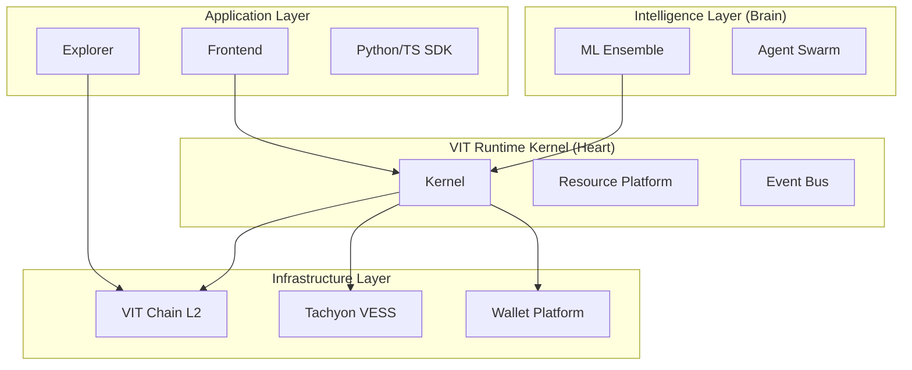

# VIT Architecture Baseline

**Date**: 2026-07-08
**Type**: Structural Verification

## 1. System Map (Operational)

| Domain | Implementation Path | Actual Capabilities |
| :--- | :--- | :--- |
| **Core** | `app/core/` | Kernel, Subsystems, Persistence, Resource Platform |
| **Platform** | `app/core/kernel.py` | Module registration, Lifecycle management |
| **Wallet** | `app/core/wallet/` | Multi-asset, high-performance balance tracking |
| **Blockchain** | `vit_chain/` | L2 implementation, Consensus (PoS), P2P Gossip |
| **AI** | `app/ai/`, `services/ml_service/` | 13-model ensemble, inference orchestration |
| **Storage** | `tachyon/` | Distributed swarm, Erasure coding (Reed-Solomon) |
| **Identity** | `app/modules/identity/`, `app/modules/did/` | Decentralized ID (DID), W3C compliant stubs |
| **Prediction** | `app/api/routes/predict.py` | Market creation, AI-backed signaling |
| **Governance** | `app/modules/governance/` | DAO protocols, Merit-based voting |
| **SDK** | `sdk/python/` | API wrappers for Chain, Wallet, and Storage |
| **Explorer** | `explorer/` | React-based visualizer for blockchain events |
| **Node** | `vit_node/` | CLI-based node runner and storage provider |
| **DevOps** | `infrastructure/`, `.github/` | GCP/Render deployment automation |
| **Docs** | `docs/`, `.engineering/` | Constitution, ADRs, and Roadmaps |

## 2. Architecture Map (Visual)

## 3. Structural Findings

### A. Capability Duplication
- **Wallet**: Legacy models exist in `app/modules/wallet/models.py`; authoritative models are in `app/core/wallet/models.py`.
- **Identity**: Identity logic is split across `app/modules/identity`, `app/modules/did`, and `app/auth`.

### B. Dead & Dark Code
- **Unmounted Routers**: ~80% of routers in `app/api/routes/` and `app/modules/` are not mounted in `main.py`.
- **Orphan Modules**: `app/modules/remittance` and `app/modules/bridge` appear to be stubs or incomplete migrations.
- **Experimental**: `/exchange` directory contains logic for a matching engine not currently integrated into the main flow.

### C. Implementation Gaps
- **Identity ↔ Admin**: Identity resolution is partially implemented but missing in the institutional admin dashboard.
- **Node Registry**: `vit_node` registry exists in code but lacks real-time performance tracking in the production dashboard.

---
**Confidence Level**: High (Verified via module tree inspection).
