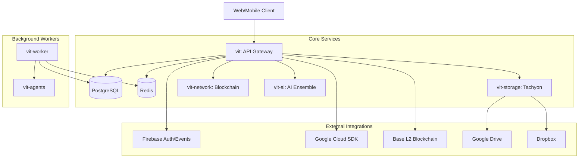

# VIT Service Dependency Graph

## 1. Visual Topology

## 2. Dependency Matrix

| Caller | Callee | Protocol | Auth | Failure Impact |
| :--- | :--- | :--- | :--- | :--- |
| Client | vit (API) | HTTPS/WSS | JWT/API Key | Total Service Outage |
| vit (API) | PostgreSQL | SQL (asyncpg) | Credentials | 500 Errors (Persistence) |
| vit (API) | Redis | RESP (aioredis) | Credentials | Degraded (Cache/Rate-limit) |
| vit (API) | Tachyon | Internal Call | Kernel Registry | 500 Errors (Storage) |
| vit (API) | Blockchain| Internal Call | Kernel Registry | 500 Errors (Settlement) |
| vit (API) | AI Ensemble| Internal Call | Kernel Registry | Degraded (Intelligence) |
| vit-worker | Redis | RESP | Credentials | Background Tasks Stop |
| Tachyon | Cloud Prov. | HTTPS (OAuth2) | Service Account| Storage Upload Fails |

## 3. Communication Standards
- **Internal**: All internal service communication (Kernel <-> Subsystem) is performed via the `VITRuntimeKernel` registry using asynchronous method calls.
- **Protocols**:
  - External: TLS 1.3 / HTTPS.
  - Database: PostgreSQL Wire Protocol (over SSL).
  - Cache: Redis Protocol (RESP).
- **Timeouts**:
  - API Requests: 30s.
  - Database Queries: 5s.
  - Internal Kernel Calls: 10s.
- **Retry Strategy**: Exponential backoff (max 3 retries) for external HTTP calls and Redis connections.

---
*Generated by Jules — VIT Engineering*
