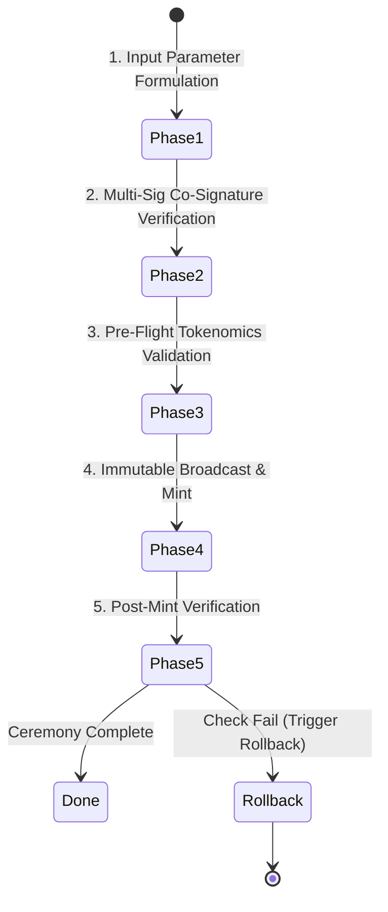

# VIT Network — Genesis Token Minting Security Protocol

**Version:** 6.0.0
**Domain:** /docs/governance/
**Status:** Design Approved

---

## 1. Purpose & Scope

The **Genesis Token Minting Security Protocol** governs the generation of the initial token supply of the VIT Network (Chain ID 7764). It defines the rigid security controls, mathematical limits, co-signature requirements, and immutable ledger operations that prevent unauthorized supply dilution, double-minting, or rogue admin actions.

This protocol is triggered during **Stage 7** of the Genesis Initialization Wizard. It is not an automated single-click operation, but a cryptographic ceremony requiring multi-party authorization.

---

## 2. Supply Configuration & Tokenomics Validation

### 2.1 supply parameters
- **Maximum Supply Cap ($S_{\text{max}}$):** $10,000,000$ VITCoin (fixed, immutable in VM code).
- **Initial Mint Supply ($S_{\text{genesis}}$):** $1,000,000$ VITCoin.
- **Treasury Reserve Allocation ($S_{\text{treasury}}$):** $700,000$ VITCoin ($70\%$ of initial mint, locked in treasury multi-sig).
- **Ecosystem Operational Reserve ($S_{\text{ops}}$):** $300,000$ VITCoin ($30\%$ of initial mint).

### 2.2 Mathematical Consistency Checks
Before the mint transaction is signed, the system evaluates the following invariant constraints:
$$\sum S_{\text{allocations}} = S_{\text{genesis}}$$
$$S_{\text{genesis}} \le S_{\text{max}}$$
$$S_{\text{treasury}} \ge 0.5 \times S_{\text{genesis}} \quad \text{(Minimum Treasury Safety Constraint)}$$

If any mathematical constraint is violated, the ceremony is aborted and a critical warning is logged.

---

## 3. The Multi-Step Confirmation Ceremony

The minting process must progress through 5 distinct, sequential verification phases:



### Phase 1: Input Parameter Formulation
The Genesis Administrator inputs the target allocations ($S_{\text{treasury}}, S_{\text{ops}}$) and the derived Treasury and operational public addresses.

### Phase 2: Multi-Sig Co-Signature Verification
The transaction payload is serialized and sent to the registered co-signers of the Genesis Treasury Multi-sig.
- **Requirement:** 2-of-3 threshold cryptographically verified using ECDSA (secp256k1).
- **Verification:**
  ```python
  from coincurve import PublicKey
  # Enforce that signature matches serialized payload and originates from registered treasury keys
  ```

### Phase 3: Pre-Flight Tokenomics Validation
The system validates the invariant constraints defined in Section 2.2. It also pings the blockchain state engine to ensure that the current block height is exactly `0` and that no other genesis block has ever been recorded.

### Phase 4: Immutable Broadcast & Mint
The genesis block is compiled, containing a single `genesis_mint` transaction. This transaction transfers the minted supply directly to the verified addresses.
- **Transaction Hash:**
  $$\text{TxHash} = \text{Keccak256}(\text{nonce} \mathbin{\Vert} \text{to\_address} \mathbin{\Vert} \text{amount} \mathbin{\Vert} \text{data})$$
- The transaction is broadcast to all peers via the gossip protocol.

### Phase 5: Post-Mint Verification
Once the genesis block is committed, the system queries the ledger to confirm balance balances:
- `Wallet.get_balance(treasury_address) == S_treasury`
- `Wallet.get_balance(ops_address) == S_ops`
- Total circulating supply on-chain must equal exactly $S_{\text{genesis}}$.

---

## 4. Irreversible Audit Logging & Traceability

Every step of the minting ceremony is recorded in an immutable log appended to the database `audit_logs` table.
- **Log Payload Details:**
  - `action`: `chain.genesis_mint_ceremony`
  - `actor`: Genesis Administrator DID (`did:vit:...`)
  - `details`:
    ```json
    {
      "ceremony_timestamp": 1735689600,
      "genesis_mint_amount": "1000000.00000000",
      "treasury_allocation": "700000.00000000",
      "ops_allocation": "300000.00000000",
      "signatures_collected": ["0x93a..."],
      "block_hash": "0x82b..."
    }
    ```
- **Integrity Rule:** The audit logging code uses an isolated database connection that bypasses standard connection pools to prevent a blocked transaction from rolling back the audit record.

---

## 5. Rollback Protection (Abort-Before-Broadcast)

To protect the ledger from corrupt genesis states, the protocol implements **Abort-Before-Broadcast (ABB)** protection:
- **Volatile Execution:** All block and transaction building occurs inside an isolated, uncommitted memory structure.
- **Failure Abort:** If any validation check fails in Phase 1, 2, or 3, the entire memory state is wiped. No database transaction is ever committed, and the blockchain is not broadcast to peer nodes.
- **Reversion Safety:** If a network failure occurs during the broadcast of Phase 4, the node halts. Upon reboot, the system reads the state from `PlatformConfig` and triggers an automated rollback, reverting the ledger height to uninitialized state.

---

## 6. Actionable Implementation Guidance

The mint ceremony can be implemented using Python secure-coding patterns:

```python
async def execute_genesis_mint(db: AsyncSession, admin_did: str, allocations: dict, signatures: list):
    # 1. Validate Allocations
    total = sum(Decimal(v) for v in allocations.values())
    if total != Decimal("1000000"):
        raise RuntimeError("Supply total mismatch")

    # 2. Cryptographic signature check
    # Iterate signatures and verify they correspond to registered Multi-sig keys...

    # 3. Build Genesis Block
    # Write audit log and commit
```

By enforcing these multi-layered, math-backed security controls, the VIT Network establishes a genesis mint process that is completely secure, verifiable, and transparent, adhering perfectly to the principles of **Trust** and **Value**.
