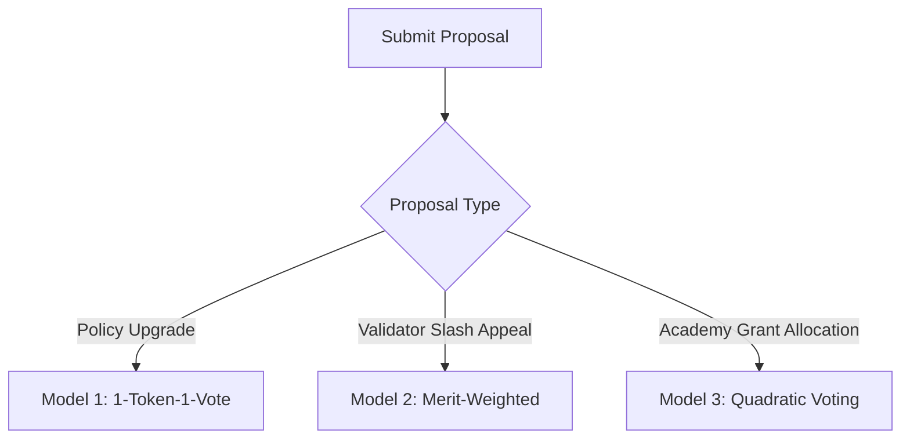

# VIT Network — Governance Constitution

**Version:** 6.0.0
**Domain:** /docs/governance/
**Status:** Canonical Reference

---

## 1. Constitutional Preamble

The VIT Network is a decentralized, self-governing intelligence network. This Governance Constitution establishes the rules, voting models, proposal lifecycles, and cryptographic standards that empower community participants to co-determine network parameters, allocate treasury resources, and appeal validator slash events.

All governance proposals must align with the three permanent principles: **Intelligence, Trust, and Value**.

---

## 2. Dynamic Voting Models & Structures

To accommodate different proposal types, VIT employs 3 specialized voting models:

### 2.1 Model 1: Standard Token-Weighted Voting (1-Token-1-Vote)
- **Applicability:** Core blockchain parameters, gas fee structures, and protocol-wide upgrades.
- **Mechanism:** A voter's voting power is directly proportional to their volume of staked VITCoin.
- **Constraints:**
  - Quorum: $20\%$ of all staked tokens.
  - Passing Threshold: Simple majority ($>50\%$) of cast votes.

### 2.2 Model 2: Merit-Weighted Voting
- **Applicability:** Dispute resolutions, validator slashing appeals, and moderator reviews.
- **Mechanism:** Voting power is determined by a user's verified trust rating (`UserTrustScore.trust_score`) and past calibration accuracy.
- **Benefit:** Protects the network from sybil attacks where rich token holders attempt to override validator slashes.

### 2.3 Model 3: Quadratic Voting (QV)
- **Applicability:** Community grant allocations, research funding, and local workspace proposals.
- **Mechanism:** The cost of casting multiple votes for a single option scales quadratically:
  $$\text{Staked Cost} = (\text{Votes Cast})^2$$
- **Benefit:** Amplifies the voice of the broader community, preventing a small set of whale wallets from monopolizing research grants.

---

## 3. Proposal Lifecycle & State Transitions

A proposal moves through 5 distinct state coordinates:

1. **Draft Phase:** The creator submits a proposal. To minimize spam, the creator must have a minimum trust rating of $\ge 50$.
2. **Active Voting Phase:** The proposal is open for voting for a fixed duration (`VOTING_WINDOW_SECONDS`, default: 7 days). Staked voting tokens are locked in the governance contract.
3. **Quorum Evaluation:** At the voting close, the contract validates if the quorum threshold is satisfied.
4. **Passed / Rejected:** If passed, the proposal enters a **48-hour timelock** cooling window.
5. **Execution Phase:** The changes are committed to the network parameters or treasury payouts are broadcast on-chain.

---

## 4. Validator Slashing & Dispute Appeals

If a validator is flagged for malicious behavior (e.g., double-signing blocks, hosting empty storage fragments), the Slashing Manager triggers an automated stake slashing event.
- **Appeal Window:** Slashed validators have exactly **48 hours** (tracked via L2 block height coordinates) to submit an appeal (`SlashAppeal` table).
- **Appeal Voting:** The appeal is evaluated using Model 2 (Merit-Weighted Voting). If approved, the slashed tokens are returned from the treasury pool; if rejected, the tokens are permanently burned.

This constitution guarantees a resilient, sybil-resistant governance framework that scales to coordinate millions of active global members.
