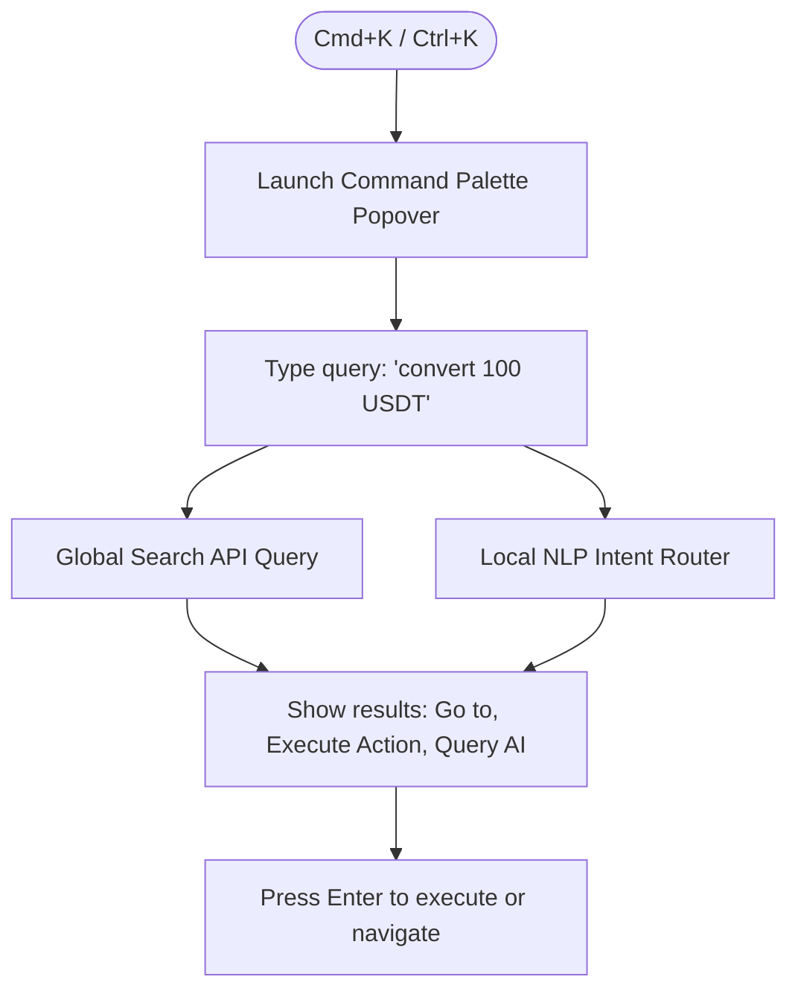

# VIT Network — Information Architecture & Routing

**Version:** 6.0.0
**Domain:** /docs/information-architecture/
**Status:** Design Approved

---

## 1. The Global Platform Shell Layout

The platform's presentation layer is structured as a **single, unified Platform Shell** that wraps all workspace pages. To prevent nested container collisions (double navigation or scrollbars), page layouts are built on a high-density grid system.

```
┌─────────────────────────────────────────────────────────────────────────┐
│                           TOP NAVIGATION BAR                            │
│  [Logo] [Workspace Picker]                      [Search] [Notif] [User] │
├──────────────┬──────────────────────────────────────────────────────────┤
│              │                                                          │
│  WORKSPACE   │                      MAIN WORKSPACE                      │
│  NAVIGATION  │                      CONTENT CANVAS                      │
│  (SIDEBAR)   │                      (RESPONSIVE)                        │
│              │                                                          │
│              │                                                          │
└──────────────┴──────────────────────────────────────────────────────────┘
```

### 1.1 Shell Container Specification
- **Wrapper Component:** `<Layout>` inside `App.tsx` serves as the global parent.
- **Header Height:** `h-16` (64px) fixed at `top-0`, `z-50`. Includes backdrop-blur (`bg-surface-900/80 backdrop-blur-md`).
- **Sidebar Width:** `w-64` (256px) fixed at `left-0`, transitioning to hidden on mobile viewports ($<768\text{px}$).
- **Content Canvas:** Margin-left `ml-64` on desktop, spanning `max-w-7xl` with default horizontal padding (`px-4 sm:px-6 lg:px-8`).

---

## 2. Navigation Architecture & Switching

### 2.1 Global Navigation
The top navigation bar provides access to global, cross-workspace settings, universal search, the command palette trigger, and notification panels.

### 2.2 Workspace-Specific Sidebar Navigation
When a user switches workspaces, the sidebar navigation dynamically redraws to display context-specific menus.
- **Example (Sports Intelligence):** Shows links to "Dashboard", "Ensemble Calibration", "Match Registry", "Fair Line Charts", and "CLV Tracker".
- **Example (Tachyon Storage):** Shows "Object Browser", "Swarm Providers", "Node Verifier", and "Storage Quotas".

### 2.3 The Workspace Switching Picker
Located in the top-left section of the header. It is a drop-down select trigger designed for speed:
1. **Trigger:** Click the workspace button or press `Option+W`.
2. **UI Interface:** A glassy popover menu containing a categorized grid of all active workspaces.
3. **Switch Action:** Clicking a workspace instantly swaps the React router context without executing a hard page reload.

---

## 3. Universal Search & Command Palette

To allow power-users (traders, developers, admins) to operate at peak efficiency, VIT integrates a global **Command Palette** accessible via the `Cmd+K` (or `Ctrl+K`) shortcut.



### 3.1 Command Scope Categories
- **Navigation Commands:** `> Go to Wallet`, `> Open Analytics Studio`.
- **System Actions:** `> Copy DID`, `> Enable TOTP`, `> Create API Key`.
- **Natural-Language Drafts:** `> Transfer 50 VIT to did:vit:...` (autofills the wallet transfer form).

---

## 4. Notifications & Live Activity Stream

### 4.1 Notification Center
Located on the top-right of the header. It is a floating popover displaying categorized notifications:
- **Alerts:** Critical warnings (e.g., validator slash warning, low storage quota).
- **Finances:** Incoming transaction confirmations (e.g., converted tokens, received rewards).
- **Ecosystem:** Proposal milestones or votes.
- **Unread Counter:** A red dot with a pulse animation (`animate-pulse`) displaying unread counts fetched from `/api/notifications/status`.

### 4.2 Real-Time Activity Feed
Available in the right-hand utility drawer of major dashboards, serving as a live websocket stream of network telemetry:
- Ingested IoT sports events (e.g., "Goal scored in competition #43").
- Active blockchain blocks proposed ("Block #4301 proposed by validator ...").
- Completed storage challenge proofs.

---

## 5. Routing Strategy & deep-linking

The platform uses **React Router v6** to enforce deep-linking and clean state paths.

### 5.1 Route Hierarchy
```
/                               # Home Page (Ecosystem Overview)
/auth/                          # Auth Group
  ├── login                     # Login Page
  └── register                  # Registration Page
/platform/                      # System Sub-path
  ├── dashboard                 # Master User Dashboard
  ├── ai                        # AI Assistant Workspace Page
  ├── sports                    # Sports Intelligence Workspace Page
  ├── wallet                    # Wallet & Financial Rails
  ├── storage                   # Tachyon Swarm Storage Workspace
  └── settings                  # Global Configuration Page
```

### 5.2 Dynamic SPA Fallback
FastAPI serves the React production frontend SPA directly from `frontend/dist`. Because React Router manages the subpaths client-side, the backend gateway includes a catch-all route handler. Any HTTP `GET` request that does not target an `/api` route must return `frontend/dist/index.html` with a `200 OK` status, preserving clean deep-linking (e.g. sharing `/platform/wallet` directly loads the correct subpage without a 404).

---

## 6. Actionable Implementation Guidance

Developers must integrate the `Cmd+K` keyboard listener in their React components:

```typescript
export const useCommandPalette = (onOpen: () => void) => {
  useEffect(() => {
    const handleKeyDown = (e: KeyboardEvent) => {
      if (e.key === "k" && (e.metaKey || e.ctrlKey)) {
        e.preventDefault();
        onOpen();
      }
    };
    window.addEventListener("keydown", handleKeyDown);
    return () => window.removeEventListener("keydown", handleKeyDown);
  }, [onOpen]);
};
```

This Information Architecture guarantees a premium, highly fluid navigation experience across all user devices.
