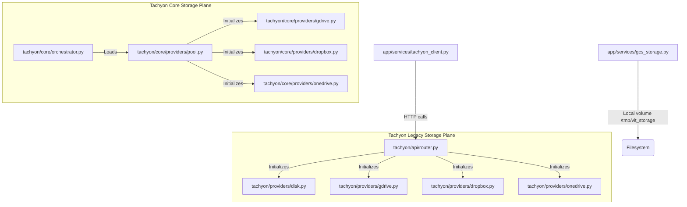

# STORAGE PROVIDER INVENTORY — VIT Ecosystem Migration

In alignment with the modular boundaries of the VIT Network, this inventory details every storage-related component discovered in Repository A (`vit`) and maps its recommended destination in Repository B (`vit-storage`).

---

## 🗺️ Architectural Dependency Graph

---

## 🔍 Detailed Component Matrix

### 1. Legacy Providers (`tachyon/providers/`)
These providers implement the legacy `CloudProvider` interface inside `vit`. They are used primarily by the local `TachyonScheduler` inside `tachyon/api/router.py`.

#### File: `tachyon/providers/base.py`
*   **Component Type:** Provider Interface
*   **Current Location:** `tachyon/providers/base.py`
*   **Destination Location:** `vit-storage` → `tachyon/providers/base.py`
*   **Migration Priority:** **High** (Foundation layer)
*   **Dependencies:** Standard Python `abc` (Abstract Base Classes)
*   **Backwards Compatibility Impact:** Standardizes core cloud provider APIs. Replacing this could break direct imports in legacy routers if method signatures are modified.
*   **Production Maturity:** High (Stable interface contract with custom return type annotations)
*   **Capabilities Verified:** Defines abstract methods for `upload_fragment`, `download_fragment`, `get_quota`, and `get_latency`.

#### File: `tachyon/providers/disk.py`
*   **Component Type:** Local Storage Adapter (Disk / Fallback)
*   **Current Location:** `tachyon/providers/disk.py`
*   **Destination Location:** `vit-storage` → `tachyon/providers/disk.py`
*   **Migration Priority:** **High** (Ensures reliable test suite fallback and local ephemeral write tests)
*   **Dependencies:** `aiofiles`, `os`, `base.py`
*   **Backwards Compatibility Impact:** Essential fallback. If missing from `vit-storage`, standard uploads default to failing when credentials are not configured.
*   **Production Maturity:** High (Extremely stable synchronous/asynchronous file writer)
*   **Capabilities Verified:** Writes binary fragment files safely to disk under `/tmp/tachyon_storage` using standard async file-io.

#### File: `tachyon/providers/gdrive.py`
*   **Component Type:** Google Drive Provider
*   **Current Location:** `tachyon/providers/gdrive.py`
*   **Destination Location:** `vit-storage` → `tachyon/providers/gdrive.py`
*   **Migration Priority:** **Medium** (Consolidated with core provider)
*   **Dependencies:** `google-oauth2`, `googleapiclient.discovery`, `asyncio`, `base64`, `json`, `base.py`
*   **Backwards Compatibility Impact:** Leverages base64-encoded or raw JSON Service Account configuration. Must be consolidated with the newer core `gdrive.py` which lacks some initializers.
*   **Production Maturity:** High (Fully handles directory creation, name-to-file-ID caching, and service discovery suppression)
*   **Capabilities Verified:** Auto-creates folder `tachyon_fragments`, manages in-memory lookup cache, reads and parses base64 environment keys, and queries Drive storage quotas.

#### File: `tachyon/providers/dropbox.py`
*   **Component Type:** Dropbox Provider
*   **Current Location:** `tachyon/providers/dropbox.py`
*   **Destination Location:** `vit-storage` → `tachyon/providers/dropbox.py`
*   **Migration Priority:** **Medium**
*   **Dependencies:** `dropbox`, `asyncio`, `base.py`
*   **Backwards Compatibility Impact:** Crucial OAuth2 configuration support. The legacy version supports OAuth refresh token flows (app key/secret/token) whereas `vit-storage`'s version only supports access tokens.
*   **Production Maturity:** High (Robust token-refresh-aware implementation)
*   **Capabilities Verified:** File uploading with overwrite and mute modes, file downloads, space usage serialization, threadpool isolation (`asyncio.to_thread`).

#### File: `tachyon/providers/onedrive.py`
*   **Component Type:** OneDrive Provider
*   **Current Location:** `tachyon/providers/onedrive.py`
*   **Destination Location:** `vit-storage` → `tachyon/providers/onedrive.py`
*   **Migration Priority:** **Medium**
*   **Dependencies:** `msal`, `urllib.request`, `asyncio`, `json`, `base.py`
*   **Backwards Compatibility Impact:** Standardizes corporate MS Graph API integration via client-credentials flow.
*   **Production Maturity:** High (Stable Azure token acquisition and standard HTTP client integration)
*   **Capabilities Verified:** Token caching, Microsoft Graph API HTTP requests (PUT/GET), quota extraction.

---

### 2. Core Providers (`tachyon/core/providers/`)
These providers are utilized by the new `ProviderPool` and `TachyonOrchestrator` inside `vit`. They utilize a different naming scheme (`upload_shard` / `download_shard`) and do not inherit from `CloudProvider`.

#### File: `tachyon/core/providers/pool.py`
*   **Component Type:** Provider Registry / Provider Factory
*   **Current Location:** `tachyon/core/providers/pool.py`
*   **Destination Location:** `vit-storage` → `tachyon/core/providers/pool.py` (Central Registry)
*   **Migration Priority:** **Critical** (This acts as the canonical Provider Registry & Provider Factory)
*   **Dependencies:** `json`, `os`, `time`, `app.config`, `gdrive.py`, `onedrive.py`, `dropbox.py`
*   **Backwards Compatibility Impact:** Controls how multiple active backend client instances are constructed, rate-limited, and selected.
*   **Production Maturity:** High (Thread-safe, round-robin dispatch, degraded-timeout guard, usage caching)
*   **Capabilities Verified:** Loads multiple credentials from arrays (`GDRIVE_SERVICE_ACCOUNT_KEYS`, `ONEDRIVE_ACCOUNTS`, `DROPBOX_TOKENS`), reads credentials directory, supports quota guard (>90% full triggers fallback), circuit-breaks degraded providers.

#### File: `tachyon/core/providers/gdrive.py`
*   **Component Type:** Google Drive Shard Provider
*   **Current Location:** `tachyon/core/providers/gdrive.py`
*   **Destination Location:** `vit-storage` → `tachyon/core/providers/gdrive.py`
*   **Migration Priority:** **High** (Core shard persistence)
*   **Dependencies:** `googleapiclient.discovery`, `google.oauth2.service_account`, `asyncio`, `io`
*   **Backwards Compatibility Impact:** None, can be merged with legacy providers into a standardized interface.
*   **Production Maturity:** High (Uses native asyncio threading run executors and resumable uploads for large chunks)
*   **Capabilities Verified:** Resumable media uploads for chunks > 5MB, health checks, detailed usage metrics, path traversal guards (`..` checks).

#### File: `tachyon/core/providers/dropbox.py`
*   **Component Type:** Dropbox Shard Provider
*   **Current Location:** `tachyon/core/providers/dropbox.py`
*   **Destination Location:** `vit-storage` → `tachyon/core/providers/dropbox.py`
*   **Migration Priority:** **High**
*   **Dependencies:** `dropbox`, `asyncio`
*   **Backwards Compatibility Impact:** None, needs to incorporate legacy token refresh logic.
*   **Production Maturity:** High
*   **Capabilities Verified:** Sandbox path listing folder checks, specific quota retrieval based on individual/team account allocations.

#### File: `tachyon/core/providers/onedrive.py`
*   **Component Type:** OneDrive Shard Provider
*   **Current Location:** `tachyon/core/providers/onedrive.py`
*   **Destination Location:** `vit-storage` → `tachyon/core/providers/onedrive.py`
*   **Migration Priority:** **High**
*   **Dependencies:** `msal`, `httpx`, `asyncio`
*   **Backwards Compatibility Impact:** Uses modern `httpx` instead of `urllib.request` for asynchronous HTTP execution.
*   **Production Maturity:** High
*   **Capabilities Verified:** Fully async Microsoft Graph interactions, silent Azure AD token fetching.

---

### 3. Clients & Helpers (Staying in `vit` as proxies)
These files act as boundaries between business logic and the storage plane. They stay inside `vit` but will be configured to delegate to `vit-storage-svc`.

#### File: `app/services/gcs_storage.py`
*   **Component Type:** Local Model Storage Client (GCS Drop-in Proxy)
*   **Current Location:** `app/services/gcs_storage.py`
*   **Destination Location:** Stays in `vit` (Legacy model loading proxy)
*   **Migration Priority:** **Low** (Internal business client)
*   **Dependencies:** `shutil`, `pathlib`, `os`
*   **Backwards Compatibility Impact:** High. Coordinates loading of `.pkl` machine learning models for predictions. It must be prepared to transparently point to `vit-storage` API via `VIT_STORAGE_USE_EXTERNAL` feature flag.
*   **Production Maturity:** Medium (Direct directory filesystem copies)
*   **Capabilities Verified:** Ephemeral model writes to `/tmp/vit_storage/models/` or `/data/models/` for Replit/Render.

#### File: `app/services/tachyon_client.py`
*   **Component Type:** Decoupled Storage Client SDK
*   **Current Location:** `app/services/tachyon_client.py`
*   **Destination Location:** Stays in `vit` (Authoritative Storage API client)
*   **Migration Priority:** **High** (Standard proxy for model/dataset interaction)
*   **Dependencies:** `httpx`, `os`
*   **Backwards Compatibility Impact:** High. Needs to support dynamic configuration via feature flags to query either local tachyon port or canonical external `vit-storage-svc` URL.
*   **Production Maturity:** High (Async HTTP client wrapper with robust exceptions isolation)
*   **Capabilities Verified:** Multipart upload bytes, download reconstruction streams, timeout limits.

---

## 📊 Summary of Provider Capabilities

| Feature Capability | Legacy Providers (`tachyon/providers/`) | Core Providers (`core/providers/`) | Proposed Standard |
| :--- | :--- | :--- | :--- |
| **Quota Mapping** | Basic (Limit, Used) | Advanced (Available, Limit, Used) | Modernized Advanced |
| **Auth Scheme** | OAuth2 Refresh, MSAL, Disk SA | JSON keys array, single token | Unified Credentials Provider |
| **Async Support** | `asyncio.to_thread` threadpool | `run_in_executor` / `httpx` async | Native Async & httpx |
| **Directory Creation**| Yes | Yes | Yes (Required Operation) |
| **Path Traversal Guard**| No | Yes | Yes (Required Operation) |
| **Resumable uploads** | No | Yes (GDrive for chunks > 5MB) | Yes |
| **Degraded Timeout** | No | Yes (600s backup lockout) | Yes |
