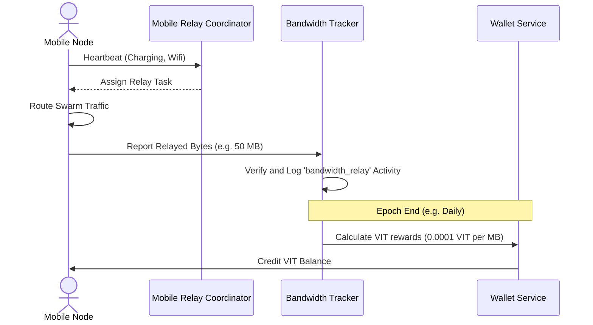

# VIT Network — Mobile Relay Coordinator & Bandwidth Rules

**Version:** 6.0.0
**Domain:** /docs/mobile/
**Status:** Spec Approved

---

## 1. Overview & Mobile Node Architecture

The VIT Network expands its peer-to-peer execution surface by utilizing user-contributed Android mobile devices. These devices operate as lightweight **Mobile Relay Nodes**, routing encrypted swarm traffic and acting as micro-caching storage units. The orchestration of these nodes is managed by the **Mobile Relay Coordinator** (`MobileRelayCoordinator` in `app/modules/network/mobile_relay.py`).

---

## 2. Heartbeat Protocol & Node Selection

Mobile nodes maintain connection status by submitting a heartbeat ping every **5 minutes** to `/api/network/android/heartbeat`.

### 2.1 Heartbeat Metadata Schema
```json
{
  "node_id": "VIT_ADDRESS_OF_NODE",
  "charge_status": "charging",
  "wifi_status": "connected",
  "storage_gb_available": 4.2,
  "battery_pct": 94,
  "last_seen": 1735689600
}
```

### 2.2 Active Coordinator Selection Heuristics
The coordinator only schedules active routing or caching tasks to mobile nodes that satisfy all Session 9.3 constraints:
1. **Time Window:** The node's last heartbeat must be recorded within the past **10 minutes**.
2. **Charging Lock:** The device must be actively connected to a power source (`charge_status == "charging"`).
3. **WiFi Lock:** The device must be connected to an active wireless network (`wifi_status == "connected"`).
4. **Battery Guard:** Battery percentage must be $\ge 20\%$.

If a node fails any of these criteria, it is dynamically pruned from the active coordinator pool, preventing user battery drain or cellular data overage.

---

## 3. Bandwidth Tracking & Rewards

Relay contributions are tracked by the `BandwidthTracker` (`app/modules/network/bandwidth.py`) and stored as `NodeActivity` records in the database with the event type `bandwidth_relay`.



### 3.1 Reward Allocation Engine
- **Target Reward Rate:** `0.0001` VIT per Megabyte (MB) relayed.
- **Aggregation:** Contributions are aggregated daily per node epoch.
- **Payout:** Paid directly out of the Ecosystem Operational Reserve into the node's `Wallet` balance.

---

## 4. Mobile Node Constraints & Limits (Session 9.3)

To ensure high-quality delivery and preserve mobile device longevity, mobile nodes operate under rigid storage and consumption caps:

- **Maximum Storage Cap:** Mobile nodes are capped at a maximum of **5 GB** (`max_storage_gb = 5`) for swarm data caching.
- **Daily Bandwidth Limit:** A default daily cap of **100 MB** (`max_bandwidth_mb_day = 100`) is enforced per mobile node to protect domestic network pools.
- **Automatic Pruning:** Swarm files cached on mobile nodes have a strict **24-hour Time-to-Live (TTL)**. Cached fragments are automatically purged after 24 hours to prevent local storage bloat.

By specifying these clear controls, the VIT Network establishes a sustainable mobile-node ecosystem that scales organically while respecting user device resources.
