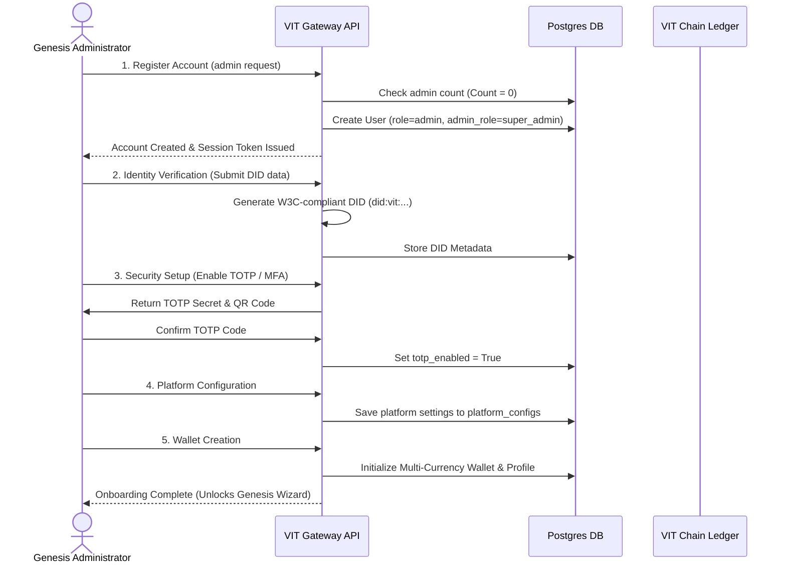

# VIT Network — Authentication, Security, and Onboarding Architecture

**Version:** 6.0.0
**Domain:** /docs/product/
**Status:** Design Approved

---

## 1. Purpose & Scope

This document specifies the authoritative design for the **Authentication, Security, and Onboarding** system of the VIT Network. It addresses the critical vulnerabilities discovered in the legacy authentication rate limiter, establishes a secure onboarding pipeline for individual, enterprise, and developer accounts, and defines the cryptographic onboarding rules for the **Genesis Administrator**.

The scope covers API endpoints, database interactions, cryptographic key derivation, Multi-Factor Authentication (MFA/TOTP), and the W3C Decentralized Identifier (DID) registration process.

---

## 2. Authentication System Audit & Repairs

### 2.1 The Rate Limiter Vulnerability
- **The Issue:** The legacy `_check_and_record_attempt` rate-limiter logic in `app/auth/routes.py` records every request as a failure (`success=False`) *before* validating the credentials, and only pops the attempt on success. If a brute-force attacker fills the sliding window limit of 10 requests, any subsequent valid login attempt is immediately blocked with a `429 Too Many Requests` status, creating a trivial Denial of Service (DoS) vector for any user account.
- **The Repair:** The sliding window rate-limiting state must be migrated from volatile in-memory dictionary storage to Redis using a non-blocking token bucket algorithm. Attempt counters should only be incremented *after* a password verification failure occurs.

### 2.2 Secure Cryptographic Defaults
- **The Issue:** Fallbacks to `"dev-secret-key"` and `"dev-jwt-secret"` in `app/config.py` can expose user sessions if environment variables are not correctly set.
- **The Repair:** The system must implement a strict bootstrap gate: if `ENVIRONMENT == "production"` and `JWT_SECRET_KEY` matches a known default fallback, the FastAPI kernel must raise a `StartupError` and fail fast, refusing to listen on any port.

---

## 3. The Genesis Administrator

To solve the "cold-start" trust problem, the first authenticated administrator of a newly bootstrapped VIT Network node is promoted to the **Genesis Administrator**.

### 3.1 Trust Promotion Protocol
1. **Bootstrap Check:** When the `/api/auth/register` or a special admin initialization route is called, the system queries the database: `SELECT COUNT(*) FROM users WHERE role = 'admin'`.
2. **Promotional Lock:** If the count is 0, the very first user who registers with an administrative request is registered as `role = 'admin'` and flagged as `admin_role = 'super_admin'` and `is_verified = True`.
3. **Genesis Lockout:** Once the Genesis Administrator record is committed within a secure transaction, the promotional gate is permanently closed. Subsequent admin registrations must be explicitly approved via an RBAC signature from the Genesis Administrator.

---

## 4. Onboarding Experience User Flow

The onboarding sequence guides the Genesis Administrator through identity verification, account securing, and parameter setup before the network can be initialized.



---

## 5. Architectural Specification

### 5.1 Identity Verification & DID Integration
During Step 2 of Onboarding, the administrator generates a W3C-compliant Decentralized Identifier (DID). The DID is derived from the SHA-256 hash of the administrator's public key:
$$\text{DID} = \text{did:vit:} + \text{Keccak256}(\text{PublicKey})[12..32]$$
This DID is anchored in the `ContentHashRegistry` and mapped to the user profile, establishing a cryptographically verifiable reputation score.

### 5.2 Multi-Factor Security Setup
- **MFA Protocol:** Time-Based One-Time Password (TOTP) conforming to RFC 6238.
- **Hashing Algorithm:** SHA-1 with a 30-second step window.
- **Key Storage:** The `totp_secret` is symmetrically encrypted in the database using AES-256-GCM, with the key derived from the platform-wide master key `PLATFORM_MASTER_SECRET`.

### 5.3 Onboarding Steps Detail

1. **Identity Verification:**
   - Input: Legal Name, Organization Name, Email, Public PGP/Encryption Key.
   - Output: Verification certificate issued by `app.modules.did.engine` (NodeContributionCredential).
2. **Security Setup:**
   - Force activation of TOTP. The account remains in a `restricted` state (cannot sign transactions, view ledger stats, or configure modules) until the first TOTP token is validated.
3. **Platform Configuration:**
   - Define base system parameters: system currency (default: USD), rate-limiting margins, backup schedules.
4. **Wallet Creation:**
   - Generate the master administrative wallet in the `wallets` table. This wallet acts as the recipient of system fees and the platform treasury anchor.

---

## 6. Security & Dependency Model

- **Dependencies:**
  - `coincurve` (secp256k1 key management)
  - `pyotp` (TOTP token generation and validation)
  - `cryptography` (AES-256-GCM encryption of database secrets)
- **Security Guardrails:**
  - Administrative session tokens (JWT) must have a maximum expiry of **15 minutes**.
  - All administrative API mutations under `/api/admin/` must include the `X-TOTP-Token` header to protect against session hijacking.
  - A comprehensive log is appended to `audit_logs` for every onboarding phase completed.

---

## 7. Actionable Implementation Guidance

To fix the brute-force lockout issue and implement the promotional boot logic, developers must rewrite the `/login` and `/register` route endpoints in `app/auth/routes.py` and implement the dynamic DID generator in `app/auth/verification.py`.

```python
# Proposed robust rate-limiting check
async def verify_login_attempt(redis, email: str, limit: int = 10, window: int = 900):
    key = f"auth:lockout:{email.lower()}"
    attempts = await redis.get(key)
    if attempts and int(attempts) >= limit:
        raise HTTPException(
            status_code=429,
            detail="Account is temporarily locked due to too many failed attempts."
        )
```

By establishing this secure onboarding foundation, VIT Network guarantees that only verified, highly-secured administrators can access the system initialization layers.
