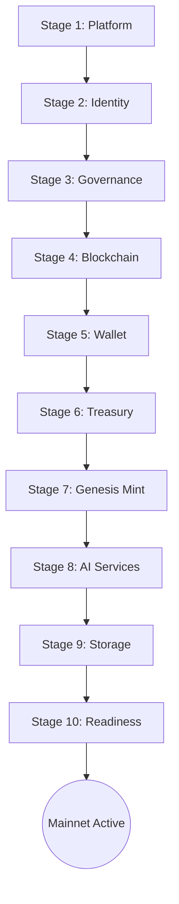

# VIT Network — Genesis Network Initialization Wizard

**Version:** 6.0.0
**Domain:** /docs/product/
**Status:** Design Approved

---

## 1. Purpose & Scope

After the Genesis Administrator has successfully completed onboarding, the platform remains locked in `BOOTSTRAP` mode. The **Genesis Network Initialization Wizard** is the authoritative, multi-stage mechanism that transitions the network into an operational production state. This document defines the 10 stages of the wizard, specifies the validation requirements for each stage, and establishes the failure-handling protocol.

Nothing is enabled, and no public routes are unblocked, until the wizard has verified all 10 stages and the Genesis Block is successfully minted.

---

## 2. The 10-Stage Genesis Initialization Sequence

The wizard progresses sequentially through the following 10 stages:



---

## 3. Detail of Initialization Stages & Validation Criteria

### Stage 1: Platform Configuration
- **Purpose:** Establish the core localized variables of the node instance.
- **Parameters:**
  - `SYSTEM_CURRENCY_BASE`: default fiat currency (e.g., USD, NGN).
  - `NODE_LABEL`: name of the validator node in the peer-to-peer network.
  - `RATE_LIMIT_MARGINS`: global maximum API requests per hour.
- **Validation:** `SYSTEM_CURRENCY_BASE` must exist in the supported list; request margins must be within $[100, 100000]$ req/hr.

### Stage 2: Identity Configuration
- **Purpose:** Define the cryptographic root of trust for DID and credential signing.
- **Parameters:**
  - `DID_RESOLVER_ENDPOINT`: URL of the W3C DID document resolver.
  - `VALIDATOR_DID_SCHEMA`: the schema version for validator identity cards.
- **Validation:** Schema must conform to the W3C DID Core 1.0 specification; resolver endpoint must return an active `200 OK` status during pre-flight ping.

### Stage 3: Governance Configuration
- **Purpose:** Configure parameters for decentralized voting and proposal cycles.
- **Parameters:**
  - `VOTING_WINDOW_SECONDS`: duration of proposals (default: 604,800 seconds / 7 days).
  - `QUORUM_THRESHOLD_PERCENT`: minimum token weight required for a vote to pass (default: 20%).
  - `MERIT_ACTIVATION_THRESHOLD`: minimum trust rating to submit a proposal.
- **Validation:** Quorum threshold must be between $10\%$ and $100\%$. Voting window must be $\ge 86400$ seconds (1 day).

### Stage 4: Blockchain Configuration
- **Purpose:** Boot the custom VIT Chain (L2) network.
- **Parameters:**
  - `VIT_CHAIN_ID`: canonical chain identifier (default: `7764`).
  - `TARGET_BLOCK_TIME_SECONDS`: target mining/consensus window (default: `15`).
  - `MAX_BLOCK_GAS_LIMIT`: maximum gas consumption per block (default: `30,000,000`).
- **Validation:** Chain ID must match `7764` or `0x1e54`. Block time must be between $5$ and $60$ seconds.

### Stage 5: Wallet Configuration
- **Purpose:** Define fee allocations and route automated system taxes.
- **Parameters:**
  - `GAS_FEE_BURN_PERCENT`: percentage of block transaction fees burned (default: `50%`).
  - `TREASURY_FEE_SHARE_PERCENT`: percentage routed to the community treasury (default: `50%`).
- **Validation:** Burn plus Treasury shares must sum exactly to $100\%$.

### Stage 6: Genesis Treasury Creation
- **Purpose:** Generate the multi-sig corporate vault for reserve allocations.
- **Parameters:**
  - `TREASURY_MULTISIG_THRESHOLD`: signature threshold (e.g., 2-of-3).
  - `TREASURY_KEY_MEMBERS`: list of public keys representing the multi-sig co-signers.
- **Validation:** Threshold must be $\le$ number of key members. Public keys must be valid secp256k1 keys.

### Stage 7: Genesis VIT Coin Mint
- **Purpose:** Permanently establish the initial coin supply on-chain.
- **Parameters:**
  - `INITIAL_MINT_SUPPLY`: total amount of VITCoin minted at Block 0 (default: `1,000,000` VIT).
  - `TREASURY_ALLOCATION_PERCENT`: percentage allocated to the Multi-sig Treasury (default: `70%`).
  - `OPERATIONAL_RESERVE_PERCENT`: percentage allocated to node operations (default: `30%`).
- **Validation:** Combined allocations must equal $100\%$. Mint supply must not exceed the maximum supply cap of $10,000,000$ VIT. Refer to the **Genesis Token Minting Security Protocol** for details.

### Stage 8: AI Service Initialization
- **Purpose:** Link and register the active machine-learning prediction models.
- **Parameters:**
  - `AI_MODELS_ACTIVE_LIST`: IDs of the 13-model ensemble models (LSTM, XGBoost, etc.).
  - `GATEWAY_ROUTING_MODE`: "fastest", "cheapest", "ensemble", or "highest_accuracy".
- **Validation:** Models in list must exist in `model_performances` metadata; the `vit-ai` service must be pinged and respond with `<100ms` latency.

### Stage 9: Storage Initialization
- **Purpose:** Initialize the Tachyon VESS swarm storage cluster.
- **Parameters:**
  - `TACHYON_ERASURE_K`: data shards count (default: `6`).
  - `TACHYON_ERASURE_M`: parity shards count (default: `3`).
  - `ACTIVE_STORAGE_PROVIDERS`: linked backends (Disk, Google Drive, Dropbox, OneDrive).
- **Validation:** $K + M \le 16$. At least one cloud provider must be active, or local `DiskProvider` must have $\ge 100\text{ GB}$ available space.

### Stage 10: Mainnet Readiness Verification
- **Purpose:** Execute comprehensive system integration pings before unlocking.
- **Verification Tests:**
  - Database constraint checking: confirms all index patterns are applied.
  - Redis ping: verifies connection latency and memory capacity.
  - Genesis state verification: confirms height 0 block has been generated.

---

## 4. State Management & Enforcement

The wizard state is persistent and stored in the `PlatformConfig` database table under the key `genesis_initialization_state`:

```json
{
  "current_stage": 1,
  "completed_stages": [],
  "parameters": {},
  "validation_results": {}
}
```

- **Blocker Rule:** The application middleware blocks all public traffic (except `/api/auth/` and `/api/system/status`) by returning a `503 Service Unavailable (System Initializing)` code until `current_stage` is updated to `10` and `status` is set to `verified`.

---

## 5. Rollback & Failure Handling

If validation fails at any stage:
1. **Zero-State Rollback:** No parameters are written to the database; the wizard remains in the last successfully verified stage.
2. **Transaction Isolation:** All database transactions for the current stage are rolled back:
   ```python
   async with db.begin():
       # rollback occurs automatically on exception
   ```
3. **Audit Log:** An event is written to `audit_logs` detailing the validation failure, the invalid parameters, and the operator's IP address.

---

## 6. Actionable Implementation Guidance

The initialization wizard can be represented by a FastAPI endpoint structure:

```python
@router.post("/genesis/initialize-stage/{stage_num}")
@require_admin
async def initialize_stage(stage_num: int, payload: dict, db: AsyncSession = Depends(get_db)):
    if stage_num < 1 or stage_num > 10:
        raise HTTPException(status_code=400, detail="Invalid stage number")

    # Run stage-specific validation...
    # Save to PlatformConfig...
    return {"status": "success", "stage": stage_num}
```

This multi-stage architecture ensures that no node operator can activate a partially configured or unstable node, preserving the **Trust** and **Value** principles of the VIT Network.
